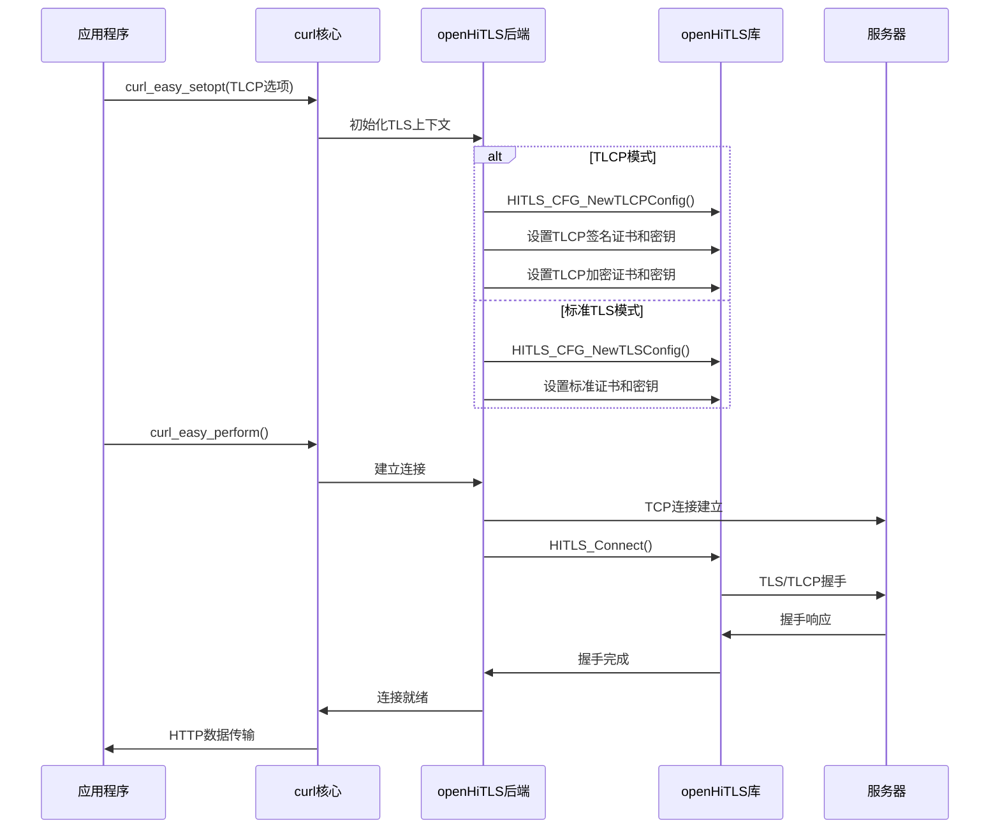
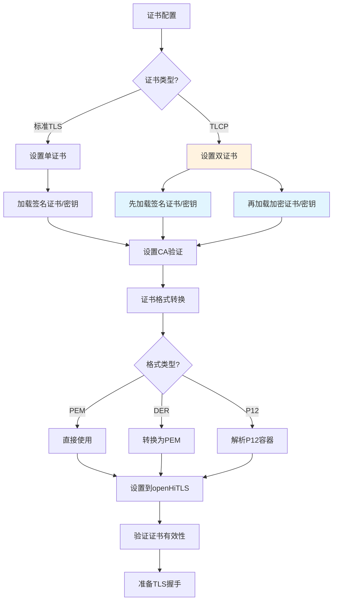

# curl + openHiTLS 集成适配总结文档

## 1. 概述

本文档详细描述了curl HTTP客户端与openHiTLS密码学库的集成适配情况，包括所有实现的功能、支持的规格以及技术架构细节。此集成为curl提供了标准TLS/SSL支持以及中国国密TLCP协议支持。

### 1.1 版本信息
- **curl版本**: 8.16.0-DEV
- **openHiTLS版本**: 基于openHiTLS库
- **TLCP支持**: GM/T 0024标准
- **引入版本**: curl 8.16.0 (TLCP选项)

### 1.2 核心价值
- 提供完整的TLS/SSL安全通信能力
- 支持中国国密TLCP协议
- 兼容curl现有API和使用方式
- 满足中国密码法规要求

## 2. 技术架构

### 2.1 整体架构图

```
┌─────────────────────────────────────────────────────────────────┐
│                        curl应用层                                │
├─────────────────────────────────────────────────────────────────┤
│                     libcurl核心层                               │
│  ┌───────────────┐  ┌─────────────────┐  ┌─────────────────┐   │
│  │  HTTP协议处理  │  │   连接管理      │  │   选项处理      │   │
│  └───────────────┘  └─────────────────┘  └─────────────────┘   │
├─────────────────────────────────────────────────────────────────┤
│                    vtls抽象层                                   │
│  ┌─────────────────────────────────────────────────────────────┐ │
│  │              openHiTLS后端实现                              │ │
│  │  ┌─────────────┐ ┌─────────────┐ ┌─────────────────────┐  │ │
│  │  │  TLS处理    │ │ TLCP处理    │ │   证书/密钥管理     │  │ │
│  │  └─────────────┘ └─────────────┘ └─────────────────────┘  │ │
│  └─────────────────────────────────────────────────────────────┘ │
├─────────────────────────────────────────────────────────────────┤
│                     openHiTLS库                                 │
│  ┌─────────────┐ ┌─────────────┐ ┌─────────────────────────────┐ │
│  │   TLS层     │ │  密码学层   │ │      证书处理层             │ │
│  │  (标准TLS)  │ │ (SM2/3/4)   │ │   (X.509/国密证书)         │ │
│  └─────────────┘ └─────────────┘ └─────────────────────────────┘ │
├─────────────────────────────────────────────────────────────────┤
│                    操作系统网络层                               │
└─────────────────────────────────────────────────────────────────┘
```

### 2.2 关键组件

#### 2.2.1 openHiTLS后端实现 (`lib/vtls/openhitls.c`)
- **文件大小**: 2,242行代码
- **核心功能**: TLS/TLCP协议处理、证书管理、会话管理
- **特殊设计**:
  - 自定义UIO层适配curl连接过滤器
  - 三阶段握手实现
  - 延迟CA存储初始化
  - 协议类型自动检测

#### 2.2.2 构建系统集成
- **配置文件**: `m4/curl-openhitls.m4`
- **自动检测**: openHiTLS库和头文件
- **编译选项**: `--with-openhitls=PATH`
- **依赖管理**: 与其他TLS后端互斥

## 3. 功能规格详述

### 3.1 标准TLS/SSL功能

#### 3.1.1 支持的TLS版本
- **TLS 1.2**: ✅ 支持
- **TLS 1.3**: ✅ 支持
- **TLCP 1.1**: ✅ 支持
- **TLS 1.0/1.1**: ❌ 不支持（安全考虑）
- **DTLS**: ❌ 暂不支持

#### 3.1.2 密码套件支持
支持openHiTLS提供的所有标准密码套件：
- **RSA密码套件**: RSA-AES-CBC/GCM系列
- **ECDHE密码套件**: ECDHE-RSA/ECDSA系列
- **国密密码套件**: SM2-SM4-SM3系列（TLCP专用）

#### 3.1.3 证书功能
```
证书加载方式:
├── 文件方式
│   ├── PEM格式: ✅ 支持
│   ├── DER格式: ✅ 支持
│   └── P12格式: ✅ 支持
├── 内存方式
│   ├── PEM缓冲区: ✅ 支持
│   ├── DER缓冲区: ✅ 支持
│   └── P12缓冲区: ✅ 支持
└── 证书验证
    ├── CA证书验证: ✅ 支持
    ├── 证书链验证: ✅ 支持
    ├── 主机名验证: ✅ 支持
    └── CRL验证: ✅ 支持
```

### 3.2 TLCP协议支持

#### 3.2.1 TLCP概述
TLCP (Transport Layer Cryptography Protocol) 是中国自主研发的传输层密码协议，遵循GM/T 0024国家密码行业标准。

#### 3.2.2 TLCP版本支持
- **TLCP 1.1**: ✅ 完整支持
- **向前兼容**: 支持协议协商

#### 3.2.3 TLCP专用功能

##### 双证书体系
```
TLCP证书架构:
├── 签名证书/密钥对
│   ├── 用途: 身份认证、数字签名
│   ├── 算法: SM2椭圆曲线
│   └── 证书: 签名证书
└── 加密证书/密钥对
    ├── 用途: 密钥交换、数据加密
    ├── 算法: SM2椭圆曲线
    └── 证书: 加密证书
```

##### 国密算法支持
- **SM2**: 椭圆曲线公钥密码算法
- **SM3**: 密码杂凑算法
- **SM4**: 分组密码算法

### 3.3 API选项支持

#### 3.3.1 标准TLS选项
```c
// 基础TLS配置
CURLOPT_SSLVERSION         // TLS版本选择
CURLOPT_SSLCERT           // 客户端证书
CURLOPT_SSLKEY            // 客户端私钥
CURLOPT_SSLCERTTYPE       // 证书格式
CURLOPT_SSLKEYTYPE        // 私钥格式
CURLOPT_KEYPASSWD         // 私钥密码
CURLOPT_CAINFO            // CA证书文件
CURLOPT_CAPATH            // CA证书目录
CURLOPT_SSL_VERIFYPEER    // 验证对端证书
CURLOPT_SSL_VERIFYHOST    // 验证主机名
```

#### 3.3.2 TLCP专用选项
```c
// TLCP协议版本 (curl 8.11.0新增)
CURLOPT_TLCP_VERSION       // 废弃，使用SSLVERSION
--tlcp1.1                  // 命令行：强制TLCP 1.1+

// TLCP加密证书/密钥 (curl 8.11.0新增)
CURLOPT_TLCP_ENC_CERT     // 加密证书
CURLOPT_TLCP_ENC_KEY      // 加密私钥
CURLOPT_TLCP_ENC_KEYPASSWD // 加密私钥密码

// 命令行对应选项
--tlcp-enc-cert <证书>     // 指定TLCP加密证书
--tlcp-enc-key <私钥>      // 指定TLCP加密私钥
```

#### 3.3.3 证书信息提取 (CERTINFO)
```c
CURLOPT_CERTINFO = 1      // 启用证书信息提取
// 返回证书链中每个证书的详细信息
// 支持标准TLS和TLCP证书
// 注意: 仅支持libcurl API，无对应命令行选项
```

## 4. 实现细节

### 4.1 连接建立流程



### 4.2 证书处理流程



**TLCP双证书配置特点**：
- 签名证书和加密证书是**先后独立配置**的关系
- 先配置签名证书（用于身份认证和数字签名）
- 后配置加密证书（用于密钥交换和数据加密）
- 两套证书必须都配置完整才能建立TLCP连接

### 4.3 错误处理机制

#### 4.3.1 调试信息
- 详细的错误日志输出
- 握手状态跟踪
- 证书验证状态报告
- openHiTLS库错误信息的友好转换

## 5. 性能和安全特性

### 5.1 性能优化
- **延迟初始化**: CA存储按需加载
- **会话复用**: 支持TLS/TLCP会话复用
- **零拷贝**: 优化的数据传输路径
- **异步I/O**: 非阻塞套接字支持

### 5.2 安全特性
- **内存安全**: 使用Secure_C边界检查
- **密钥保护**: 安全的密钥内存管理
- **证书验证**: 完整的证书链验证
- **协议隔离**: TLCP与TLS严格分离

## 6. 测试覆盖范围

### 6.1 测试分类框架

curl openHiTLS集成测试应分为两大块：
- **命令行测试**: 验证curl命令行工具的TLS/TLCP功能
- **libcurl API测试**: 验证libcurl库的编程接口功能

### 6.2 协议版本配置测试

#### 6.2.1 命令行测试
```bash
# TLS版本配置
curl --tlsv1.2 https://server/          # 强制TLS 1.2
curl --tlsv1.3 https://server/          # 强制TLS 1.3
curl --tls-max 1.3 https://server/      # 最大TLS 1.3
curl --tlcp1.1 https://server/          # 强制TLCP 1.1

# 版本协商测试
curl -v --tlsv1.2 --tls-max 1.3 https://server/  # TLS 1.2-1.3范围
```

#### 6.2.2 libcurl API测试
```c
// TLS版本配置选项
CURLOPT_SSLVERSION          // 设置SSL/TLS版本
CURLOPT_SSLVERSION_MIN      // 最小SSL/TLS版本
CURLOPT_SSLVERSION_MAX      // 最大SSL/TLS版本

// 使用示例
curl_easy_setopt(curl, CURLOPT_SSLVERSION, CURL_SSLVERSION_TLSv1_2);
curl_easy_setopt(curl, CURLOPT_SSLVERSION, CURL_SSLVERSION_TLSv1_3);
```

### 6.3 证书配置测试

#### 6.3.1 信任证书加载测试

**命令行方式:**
```bash
# 文件方式加载CA证书
curl --cacert ca-bundle.pem https://server/
curl --capath /etc/ssl/certs/ https://server/

# CA证书目录功能
curl --capath /path/to/ca/dir https://server/
```

**libcurl API方式:**
```c
// 文件加载
CURLOPT_CAINFO             // CA证书文件路径
CURLOPT_CAPATH             // CA证书目录路径

// 内存加载
CURLOPT_CAINFO_BLOB        // CA证书内存数据

// 使用示例
curl_easy_setopt(curl, CURLOPT_CAINFO, "/path/to/ca-bundle.pem");
curl_easy_setopt(curl, CURLOPT_CAPATH, "/etc/ssl/certs");

struct curl_blob ca_blob = {ca_data, ca_size, 0};
curl_easy_setopt(curl, CURLOPT_CAINFO_BLOB, &ca_blob);
```

#### 6.3.2 客户端证书和私钥加载测试

**标准TLS证书 - 命令行:**
```bash
# PEM格式
curl --cert client.pem --key client-key.pem https://server/
curl --cert client.pem --key client-key.pem --pass keypass https://server/

# DER格式
curl --cert client.der --cert-type DER --key client-key.der --key-type DER https://server/

# P12格式
curl --cert client.p12 --cert-type P12 --pass p12password https://server/
```

**标准TLS证书 - libcurl API:**
```c
// 文件方式
CURLOPT_SSLCERT            // 客户端证书文件
CURLOPT_SSLCERTTYPE        // 证书格式 (PEM/DER/P12)
CURLOPT_SSLKEY             // 私钥文件
CURLOPT_SSLKEYTYPE         // 私钥格式
CURLOPT_KEYPASSWD          // 私钥密码

// 内存方式
CURLOPT_SSLCERT_BLOB       // 证书内存数据
CURLOPT_SSLKEY_BLOB        // 私钥内存数据

// 使用示例
curl_easy_setopt(curl, CURLOPT_SSLCERT, "client.pem");
curl_easy_setopt(curl, CURLOPT_SSLKEY, "client-key.pem");
curl_easy_setopt(curl, CURLOPT_KEYPASSWD, "password");

struct curl_blob cert_blob = {cert_data, cert_size, 0};
curl_easy_setopt(curl, CURLOPT_SSLCERT_BLOB, &cert_blob);
```

**TLCP双证书 - 命令行:**
```bash
# TLCP完整配置
curl --cert sign.pem --key sign-key.pem \
     --tlcp-enc-cert enc.pem --tlcp-enc-key enc-key.pem \
     --tlcp1.1 https://tlcp-server/

# 带密码的TLCP证书
curl --cert sign.pem --key sign-key.pem --pass signpass \
     --tlcp-enc-cert enc.pem --tlcp-enc-key enc-key.pem \
     --tlcp1.1 https://tlcp-server/
```

**TLCP双证书 - libcurl API:**
```c
// TLCP专用选项
CURLOPT_TLCP_ENC_CERT      // TLCP加密证书
CURLOPT_TLCP_ENC_KEY       // TLCP加密私钥
CURLOPT_TLCP_ENC_KEYPASSWD // TLCP加密私钥密码

// 使用示例 (双证书必须都配置)
curl_easy_setopt(curl, CURLOPT_SSLCERT, "sign.pem");        // 签名证书
curl_easy_setopt(curl, CURLOPT_SSLKEY, "sign-key.pem");     // 签名私钥
curl_easy_setopt(curl, CURLOPT_TLCP_ENC_CERT, "enc.pem");   // 加密证书
curl_easy_setopt(curl, CURLOPT_TLCP_ENC_KEY, "enc-key.pem"); // 加密私钥
curl_easy_setopt(curl, CURLOPT_SSLVERSION, CURL_SSLVERSION_TLSv1_3); // TLCP版本
```

#### 6.3.3 支持的证书格式测试
- **PEM格式**: Base64编码的文本格式 ✅
- **DER格式**: 二进制格式 ✅
- **P12格式**: PKCS#12容器格式 ✅

#### 6.3.4 证书验证测试

**命令行方式:**
```bash
# 启用/禁用对端证书验证
curl --insecure https://server/          # 禁用证书验证

# 主机名验证
curl --connect-to server:443:realserver:443 https://server/  # 主机名不匹配测试
```

**libcurl API方式:**
```c
CURLOPT_SSL_VERIFYPEER     // 验证对端证书 (0=禁用, 1=启用)
CURLOPT_SSL_VERIFYHOST     // 验证主机名 (0=禁用, 2=启用)
// 注意: CURLOPT_SSL_VERIFYSTATUS (OCSP验证) 在openHiTLS中不支持

// 使用示例
curl_easy_setopt(curl, CURLOPT_SSL_VERIFYPEER, 1L);
curl_easy_setopt(curl, CURLOPT_SSL_VERIFYHOST, 2L);
```

### 6.4 密码套件和算法配置测试

#### 6.4.1 命令行方式
```bash
# TLS密码套件配置
curl --ciphers "ECDHE-RSA-AES256-GCM-SHA384" https://server/
curl --tls13-ciphers "TLS_AES_256_GCM_SHA384" https://server/

# 注意: --curves 选项在openHiTLS中不支持
```

#### 6.4.2 libcurl API方式
```c
CURLOPT_SSL_CIPHER_LIST    // TLS 1.2及以下密码套件
CURLOPT_TLS13_CIPHERS      // TLS 1.3密码套件
// 注意: CURLOPT_SSL_EC_CURVES (椭圆曲线配置) 在openHiTLS中不支持

// 使用示例
curl_easy_setopt(curl, CURLOPT_SSL_CIPHER_LIST, "ECDHE-RSA-AES256-GCM-SHA384");
curl_easy_setopt(curl, CURLOPT_TLS13_CIPHERS, "TLS_AES_256_GCM_SHA384");
```

### 6.5 curl TLS相关选项全集

#### 6.5.1 命令行参数全集

**基础TLS配置:**
- `--tlsv1.2` - 强制TLS 1.2 ✅
- `--tlsv1.3` - 强制TLS 1.3 ✅
- `--tls-max <version>` - 最大TLS版本 ✅
- `--ssl-reqd` - 要求SSL/TLS连接 ✅
- `--ssl` - 尝试SSL/TLS连接 ✅

**证书和密钥:**
- `--cert <certificate>` - 客户端证书 ✅
- `--cert-type <type>` - 证书格式(PEM/DER/P12) ✅
- `--key <key>` - 私钥文件 ✅
- `--key-type <type>` - 私钥格式 ✅
- `--pass <phrase>` - 私钥密码 ✅
- `--cacert <file>` - CA证书文件 ✅
- `--capath <dir>` - CA证书目录 ✅
- `--crlfile <file>` - 证书吊销列表文件 ✅

**TLCP专用选项:**
- `--tlcp1.1` - 强制TLCP 1.1+ ✅
- `--tlcp-enc-cert <cert>` - TLCP加密证书 ✅
- `--tlcp-enc-key <key>` - TLCP加密私钥 ✅

**验证控制:**
- `--insecure` - 禁用证书验证 ✅

**算法配置:**
- `--ciphers <list>` - 密码套件列表 ✅
- `--tls13-ciphers <list>` - TLS 1.3密码套件 ✅

**不支持的算法选项:**
- `--curves <list>` - 椭圆曲线配置 ❌

**高级选项:**
- `--no-alpn` - 禁用ALPN TLS扩展 ✅

**不支持的选项:**
- `--cert-status` - 验证证书状态(OCSP) ❌
- `--pinnedpubkey <key>` - 固定公钥 ❌
- `--sigalgs <list>` - TLS签名算法 ❌
- `--no-sessionid` - 禁用SSL会话ID重用 ❌

**代理TLS选项:**
- `--proxy-cert <cert>` - 代理客户端证书 ✅
- `--proxy-key <key>` - 代理私钥 ✅
- `--proxy-cacert <file>` - 代理CA证书 ✅
- `--proxy-capath <dir>` - 代理CA目录 ✅
- `--proxy-insecure` - 禁用代理证书验证 ✅

#### 6.5.2 libcurl API选项全集

**基础配置 (已支持✅):**
- `CURLOPT_SSLVERSION` - SSL/TLS版本
- `CURLOPT_USE_SSL` - SSL/TLS使用模式

**证书和密钥 (已支持✅):**
- `CURLOPT_SSLCERT` - 客户端证书文件
- `CURLOPT_SSLCERT_BLOB` - 客户端证书内存数据
- `CURLOPT_SSLCERTTYPE` - 证书格式
- `CURLOPT_SSLKEY` - 私钥文件
- `CURLOPT_SSLKEY_BLOB` - 私钥内存数据
- `CURLOPT_SSLKEYTYPE` - 私钥格式
- `CURLOPT_KEYPASSWD` - 私钥密码
- `CURLOPT_CAINFO` - CA证书文件
- `CURLOPT_CAINFO_BLOB` - CA证书内存数据
- `CURLOPT_CAPATH` - CA证书目录
- `CURLOPT_CRLFILE` - 证书吊销列表文件
- `CURLOPT_ISSUERCERT` - 颁发者证书文件
- `CURLOPT_ISSUERCERT_BLOB` - 颁发者证书内存数据

**TLCP专用 (已支持✅):**
- `CURLOPT_TLCP_ENC_CERT` - TLCP加密证书
- `CURLOPT_TLCP_ENC_KEY` - TLCP加密私钥
- `CURLOPT_TLCP_ENC_KEYPASSWD` - TLCP加密私钥密码

**验证控制 (已支持✅):**
- `CURLOPT_SSL_VERIFYPEER` - 验证对端证书
- `CURLOPT_SSL_VERIFYHOST` - 验证主机名
- `CURLOPT_CERTINFO` - 获取证书信息

**算法配置 (已支持✅):**
- `CURLOPT_SSL_CIPHER_LIST` - 密码套件列表
- `CURLOPT_TLS13_CIPHERS` - TLS 1.3密码套件

**不支持的算法选项:**
- `CURLOPT_SSL_EC_CURVES` - 椭圆曲线配置 ❌

**高级选项:**
- `CURLOPT_SSL_ENABLE_ALPN` - ALPN协商 ✅
- `CURLOPT_SSL_SESSIONID_CACHE` - 会话缓存 ✅
- `CURLOPT_SSL_CTX_FUNCTION` - SSL上下文回调函数 ✅
- `CURLOPT_SSL_CTX_DATA` - SSL上下文回调数据 ✅
- `CURLOPT_CA_CACHE_TIMEOUT` - CA证书缓存超时 ✅

**不支持的选项:**
- `CURLOPT_SSL_VERIFYSTATUS` - 验证证书状态(OCSP) ❌
- `CURLOPT_PINNEDPUBLICKEY` - 固定公钥 ❌
- `CURLOPT_SSL_SIGNATURE_ALGORITHMS` - TLS签名算法 ❌
- `CURLOPT_SSL_OPTIONS` - SSL选项标志位 ❌
- `CURLOPT_SSLENGINE` - SSL引擎 ❌
- `CURLOPT_SSLENGINE_DEFAULT` - 默认SSL引擎 ❌

**代理TLS (已支持✅):**
- `CURLOPT_PROXY_SSLCERT` - 代理客户端证书
- `CURLOPT_PROXY_SSLKEY` - 代理私钥
- `CURLOPT_PROXY_CAINFO` - 代理CA证书
- `CURLOPT_PROXY_CAPATH` - 代理CA目录
- `CURLOPT_PROXY_SSL_VERIFYPEER` - 代理证书验证
- 及相关_BLOB版本

### 6.6 构建测试

#### 6.6.1 基础构建验证
```bash
# 验证openHiTLS支持编译进curl
curl -V | grep -i hitls
curl -V | grep -i openhitls

# 验证支持的协议
curl -V | grep "Protocols:"

# 验证支持的特性
curl -V | grep "Features:"
```

#### 6.6.2 功能特性检测
```bash
# 检查TLS后端
curl --version | grep openHiTLS

# 验证TLCP选项可用性
curl --help | grep tlcp

# 测试基本连接
curl -v --tlsv1.2 https://httpbin.org/get
curl -v --tlsv1.3 https://httpbin.org/get
```

### 6.7 错误场景和边界测试

#### 6.7.1 证书错误测试
```bash
# 无效证书
curl https://expired.badssl.com/           # 应失败
curl -k https://expired.badssl.com/        # 应成功

# 主机名不匹配
curl https://wrong.host.badssl.com/        # 应失败
curl -k https://wrong.host.badssl.com/     # 应成功

# 自签名证书
curl https://self-signed.badssl.com/       # 应失败
curl -k https://self-signed.badssl.com/    # 应成功
```

#### 6.7.2 协议版本测试
```bash
# 强制不支持的版本
curl --tlsv1.0 https://server/             # 应失败
curl --tlsv1.1 https://server/             # 应失败

# TLCP与标准TLS混用
curl --tlcp1.1 --tlsv1.2 https://server/  # 应失败或警告
```

#### 6.7.3 配置错误测试
```bash
# TLCP不完整配置
curl --tlcp-enc-cert enc.pem https://server/  # 缺少加密私钥，应失败

# 文件不存在
curl --cert nonexist.pem https://server/      # 应失败
curl --cacert nonexist.pem https://server/    # 应失败

# 密码错误
curl --cert encrypted.p12 --pass wrong https://server/  # 应失败
```

### 6.8 性能和兼容性测试

#### 6.8.1 性能基准测试
```bash
# 连接建立时间测试
time curl -w "%{time_connect}\n" -o /dev/null -s https://server/

# 吞吐量测试
curl -w "%{speed_download}\n" -o /dev/null -s https://server/largefile

# 并发连接测试
seq 1 10 | xargs -n1 -P10 curl -o /dev/null -s https://server/
```

#### 6.8.2 互操作性测试
```bash
# 与不同TLS服务器测试
curl -v https://tls-v1-2.badssl.com:1012/  # TLS 1.2 only
curl -v https://tls-v1-3.badssl.com:1013/  # TLS 1.3 only

# 与各种CA证书测试
curl -v https://letsencrypt.org/           # Let's Encrypt CA
curl -v https://google.com/                # DigiCert CA
```

## 7. 构建和部署

### 7.1 编译依赖
```bash
# 必需依赖
openHiTLS库 (>=版本要求)
Secure_C库 (边界检查)
zlib (压缩支持)
nghttp2 (HTTP/2支持)

# 可选依赖
libpsl (公共后缀列表)
```

### 7.2 构建配置
```bash
# 配置编译选项
./configure \
  --with-openhitls=/path/to/openhitls \
  --with-nghttp2=/path/to/nghttp2 \
  --prefix=/install/path

# 编译和安装
make -j
make install
```

### 7.3 运行时配置
```bash
# 设置库路径
export LD_LIBRARY_PATH=/path/to/libs:$LD_LIBRARY_PATH

# 验证构建结果
curl -V
# 输出应包含: openHiTLS, HTTP2, SSL等特性
```

## 8. 限制和注意事项

### 8.1 当前限制
- **Form API**: 在当前构建中被禁用
- **DTLS**: 暂不支持DTLS协议
- **某些高级特性**: 部分openSSL特有功能可能不支持

### 8.2 使用注意事项
- TLCP协议仅用于与支持国密的服务器通信
- 双证书配置必须完整（签名+加密）
- 证书格式必须与服务器要求匹配
- 协议版本需要客户端和服务器协商一致

## 9. 故障排除

### 9.1 常见问题
1. **编译错误**: 检查openHiTLS库路径和版本
2. **连接失败**: 验证证书配置和服务器支持
3. **握手失败**: 检查协议版本和密码套件匹配
4. **证书错误**: 验证证书有效性和信任链

### 9.2 调试方法
```bash
# 启用详细输出
curl -v --trace-ascii trace.log https://server/

# 检查库依赖
ldd /path/to/curl

# 验证证书
openssl x509 -in cert.pem -text -noout
```

## 10. 未来规划

### 10.1 待完善功能
- DTLS协议支持
- 更多国密算法支持
- 性能进一步优化
- 测试覆盖率提升

### 10.2 标准跟踪
- 跟踪TLCP标准更新
- 兼容性持续改进
- 安全漏洞及时修复

---

**文档版本**: v2.0
**最后更新**: 2025-09-19
**基于**: curl 8.16.0-DEV with openHiTLS integration
**更新说明**: 根据TLS选项完整规格表更新支持状态和示例
**维护者**: curl openHiTLS集成团队